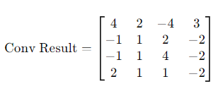
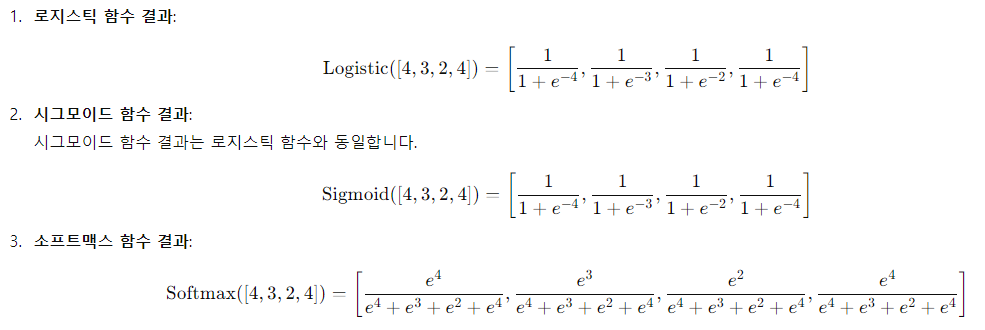

# 1. CNN의 개념


다음은 input(입력), 기능 학습 및 분류 단계를 보여주는 CNN 알고리즘 프로세스를 설명하는 자세한 다이어그램입니다. 이미지는 컨볼루셔널 신경망(Convolutional Neural Network)이 각 단계를 통해 데이터를 처리하고 분류하는 방법을 시각적으로 나타냅니다.

CNN(Convolutional Neural Network, 합성곱 신경망)은 이미지 인식 및 처리에 자주 사용되는 딥러닝 알고리즘입니다. CNN은 특히 이미지의 공간적 구조를 잘 반영하는 특성 덕분에 컴퓨터 비전 작업에서 뛰어난 성능을 발휘합니다.


<br>

## 1-1. 입력 레이어 (Input Layer)

CNN은 이미지 데이터를 입력으로 받습니다. 일반적으로 이미지는 너비, 높이, 색상 채널(RGB)로 구성된 3차원 배열로 표현됩니다.


<br><br><br>

## 1-2. 합성곱 레이어 (Convolutional Layer)

합성곱 연산: 합성곱 레이어는 필터(또는 커널)라 불리는 작은 가중치 행렬을 사용해 입력 이미지에 적용됩니다. 이 필터는 이미지의 특정 패턴(예: 가장자리, 텍스처 등)을 추출하는 역할을 합니다.
특징 맵 (Feature Map): 필터가 입력 데이터에 적용되어 나온 결과가 특징 맵으로, 이는 이미지 내의 특정 패턴을 강조하여 나타낸 것입니다.
Stride와 Padding: 필터를 적용하는 간격을 stride라고 하며, 이미지 경계를 처리하기 위해 사용되는 추가 픽셀을 padding이라고 합니다. Stride와 Padding은 출력 크기에 영향을 미칩니다.




<br><br><br>

## 1-3. 활성화 함수 (Activation Function)

ReLU(Rectified Linear Unit): 비선형 활성화 함수로, 특징 맵의 음수를 모두 0으로 바꿔줍니다. 이는 네트워크에 비선형성을 추가하여 더 복잡한 패턴을 학습할 수 있게 합니다.


<br><br><br>

## 1-4. 풀링 레이어 (Pooling Layer)

Max Pooling: 가장 많이 사용되는 풀링 방식으로, 작은 영역에서 가장 큰 값을 선택하여 데이터 크기를 줄이고 불변성을 강화합니다.
Average Pooling: 영역 내의 평균값을 사용하는 풀링 방식으로, 특징 맵의 크기를 줄이면서 주요 정보를 유지하는 역할을 합니다.
풀링 레이어는 특징 맵의 크기를 줄이고 계산 효율성을 높이며, 오버피팅을 방지하는 데 도움을 줍니다.


<br><br><br>

## 1-5. 완전 연결 레이어 (Fully Connected Layer, FC Layer)

합성곱 및 풀링 레이어를 거쳐 축소된 특징 맵은 1차원 벡터로 펼쳐져(Flatten) 완전 연결 레이어로 전달됩니다.
이 레이어에서는 모든 입력 뉴런이 다음 레이어의 모든 뉴런과 연결되며, CNN이 최종적으로 분류 작업을 수행하는 역할을 합니다.


<br><br><br>

## 1-6. 출력 레이어 (Output Layer)

Softmax: 다중 클래스 분류 문제에서는 Softmax 활성화 함수가 사용되며, 입력을 확률로 변환하여 가장 가능성 높은 클래스를 선택합니다.
Sigmoid: 이진 분류에서는 Sigmoid 함수가 사용되며, 출력값을 0과 1 사이의 값으로 제한합니다.





<br><br><br>

## 1-7. 학습 과정 (Training Process)

CNN은 손실 함수(예: 교차 엔트로피 손실)를 최소화하는 방향으로 가중치를 조정합니다.

**역전파 (Backpropagation)** 와 경사 하강법 (Gradient Descent) 알고리즘이 사용되어 

네트워크의 가중치를 업데이트합니다.


<br><br><br>

## 1-8. 이미지 인식 및 분류 과정(Classification)

Flattening 되어 평탄화된 행렬을 ReLU, Softmax 함수를 거쳐 확률 형태로 output을 얻는 단계를 의미합니다.


<br><br><br>

## 1-8. 응용 분야

CNN은 이미지 분류, 객체 검출, 얼굴 인식, 자율 주행, 의료 영상 분석 등 다양한 분야에 널리 사용됩니다.


<br><br><br><br>

# 2. CNN을 활용한 손글씨 판별하기

손글씨로 그리기나 업로드된 이미지의 숫자 판별하기

<br>

## 2-1. 프로젝트 파일 구조

```csharp
handwrite_syatem/
│
├── app.py  # Flask 웹 애플리케이션의 진입점
├── model.py  # CNN 러닝 모델
├── uploads/  # 사용자가 업로드한 파일을 저장하는 디렉터리
├── templates/
│   ├── im.html     # 이미지 업로드 템플릿
│   ├── index.html  # 메인 페이지 템플릿
│   └── index_old.html  # 결과 전 페이지 템플릿
└── mnist_model.h5  # 학습한 내용이 저장되는 파일
```

<br><br><br>

## 2-2. 패키지 설치

```bsah
(.venv) pip install Flask tensorflow numpy pillow
```

<br><br><br>

## 2-3. 소스 코드

### 2-3-1. model.py

```python
#@title MNIST

import tensorflow.keras.utils as utils
from tensorflow.keras.datasets import mnist
from tensorflow.keras.models import Sequential
from tensorflow.keras.layers import Dense, Activation
import numpy as np
import matplotlib.pyplot as plt

np.random.seed(3)

(X_train, Y_train), (X_test, Y_test) = mnist.load_data()


X_val = X_train[50000:]
Y_val = Y_train[50000:]
X_train = X_train[:50000]
Y_train = Y_train[:50000]

X_train = X_train.reshape(50000, 784).astype('float32') / 255.0
X_val = X_val.reshape(10000, 784).astype('float32') / 255.0
X_test = X_test.reshape(10000, 784).astype('float32') / 255.0

Y_train = utils.to_categorical(Y_train)
Y_val = utils.to_categorical(Y_val)
Y_test = utils.to_categorical(Y_test)

model = Sequential()
model.add(Dense(units=800, input_dim=28*28, activation='relu'))
model.add(Dense(units=500, activation='relu'))
model.add(Dense(units=10, activation='softmax'))


model.compile(loss='categorical_crossentropy', optimizer='adam', metrics=['accuracy'])


hist = model.fit(X_train, Y_train, epochs=5,
                 batch_size=10, validation_data=(X_val, Y_val),verbose=1)

fig, loss_ax = plt.subplots()

acc_ax = loss_ax.twinx()

loss_ax.plot(hist.history['loss'], 'y', label='train loss')
loss_ax.plot(hist.history['val_loss'], 'r', label='val loss')

acc_ax.plot(hist.history['accuracy'], 'b', label='train acc')
acc_ax.plot(hist.history['val_accuracy'], 'g', label='val acc')

loss_ax.set_xlabel('epoch')
loss_ax.set_ylabel('loss')
acc_ax.set_ylabel('accuray')

loss_ax.legend(loc='upper left')
acc_ax.legend(loc='lower left')

plt.show()

scores = model.evaluate(X_test, Y_test)
print("%s: %.2f%%" %(model.metrics_names[1], scores[1]*100))
```

<br><br>

### 2-3-2. app.py

```python
from flask import Flask, render_template, request, jsonify, redirect, url_for
from tensorflow.keras.models import load_model
import numpy as np
from PIL import Image
import os
import matplotlib.pyplot as plt

app = Flask(__name__)

@app.route('/')
def home():
    return render_template('index.html')

@app.route('/im')
def im(result=None):
    return render_template('im.html', result=result)

# 설정: 업로드된 파일을 저장할 디렉토리
app.config['UPLOAD_FOLDER'] = 'uploads/'
app.config['ALLOWED_EXTENSIONS'] = {'txt', 'pdf', 'png', 'jpg', 'jpeg', 'gif'}

# 파일 확장자가 허용된 것인지 확인하는 함수
def allowed_file(filename):
    return '.' in filename and \
           filename.rsplit('.', 1)[1].lower() in app.config['ALLOWED_EXTENSIONS']
def process_file(file_path):
    try:
        with Image.open(file_path) as img:
            if img.mode != 'L':
                img = img.convert('L')
            # img = img.resize((28, 28))
            img_array = np.array(img)
            model = load_model('mnist_model.h5')
            test_data = img_array.reshape(1, 784)
            yhat_test = model.predict(test_data)
            print(np.argmax(yhat_test))
            processed_data = np.argmax(yhat_test)

            return str(processed_data)
    except Exception as e:
        return f"Error processing file: {e}"

@app.route('/upload', methods=['POST'])
def upload():
    data = request.json
    image_data = data.get('image')
    # 이미지 데이터를 처리하는 코드 추가
    # 예: image_data를 리스트로 변환
    image_list = list(map(int, image_data.split(',')))


    model = load_model('mnist_model.h5')
    test_data = np.array(image_list)
    test_data = test_data.reshape(1, 784)
    yhat_test = model.predict(test_data)
    print(np.argmax(yhat_test))

    # 필요한 추가 처리 수행
    processed_data = np.argmax(yhat_test)

    return jsonify({'status': 'success', 'processed_data': int(processed_data)})


@app.route('/upload2', methods=['POST'])
def upload_file():
    if 'file' not in request.files:
        return im("No file part")
    file = request.files['file']

    # 파일이 없거나 파일명이 비어있는 경우
    if file.filename == '':
        return im("No selected file")

    # 파일이 허용된 형식인지 확인
    if file and allowed_file(file.filename):
        filename = file.filename
        file_path = os.path.join(app.config['UPLOAD_FOLDER'], filename)
        file.save(file_path)

        # 파일을 읽어 처리
        result = process_file(file_path)

        return im(result)

    return im("File type is not allowed")


if __name__ == '__main__':
    app.run(debug=True)


# from flask import Flask, render_template
#
# app = Flask(__name__)
#
# @app.route('/')
# def home():
#     name = "Alice"
#     value = 42
#     return render_template('index.html', name=name, value=value)
#
# if __name__ == '__main__':
#     app.run(debug=True)
```

<br><br>

### 2-3-3. template/im.html

```html
<!DOCTYPE html>
<html lang="en">
<head>
    <meta charset="UTF-8">
    <meta name="viewport" content="width=device-width, initial-scale=1.0">
    <title>File Upload</title>
</head>
<body>
    <h1>Upload a File</h1>
    <form action="/upload2" method="post" enctype="multipart/form-data">
        <input type="file" name="file" />
        <input type="submit" value="Upload" />
    </form>
    
    <h2>Processing Result:</h2>
    <p>{{ result }}</p>
    
</body>
</html>
```

<br><br>

### 2-3-4. tempalte/index.html

```html
<!DOCTYPE html>
<html lang="en">
<head>
    <meta charset="UTF-8">
    <meta name="viewport" content="width=device-width, initial-scale=1.0">
    <title>Flask Drawing Canvas</title>
</head>
<body>
    <table>
        <td style="border-style: none;">
            <div style="border: solid 2px #666; width: 143px; height: 144px;">
                <canvas width="140" height="140" id="drawingCanvas"></canvas>
            </div>
        </td>
        <td style="border-style: none;">
            <button onclick="clearCanvas()">Clear</button>
            <button onclick="sendData()">Send</button>
        </td>
    </table>
    <div id="result"></div>
    <script type="text/javascript">
        var pixels = [];
        for (var i = 0; i < 28 * 28; i++) pixels[i] = 0;

        var click = 0;

        var canvas = document.getElementById("drawingCanvas");
        canvas.addEventListener("mousemove", function(e) {
            if (e.buttons == 1) {
                click = 1;
                canvas.getContext("2d").fillStyle = "rgb(0,0,0)";
                canvas.getContext("2d").fillRect(e.offsetX, e.offsetY, 8, 8);
                var x = Math.floor(e.offsetY * 0.2);
                var y = Math.floor(e.offsetX * 0.2) + 1;
                for (var dy = 0; dy < 2; dy++) {
                    for (var dx = 0; dx < 2; dx++) {
                        if ((x + dx < 28) && (y + dy < 28)) {
                            pixels[(y + dy) + (x + dx) * 28] = 1;
                        }
                    }
                }
            } else {
                if (click == 1) {
                    click = 0;
                }
            }
        });

        function clearCanvas() {
            canvas.getContext("2d").fillStyle = "rgb(255,255,255)";
            canvas.getContext("2d").fillRect(0, 0, 140, 140);
            for (var i = 0; i < 28 * 28; i++) pixels[i] = 0;
        }

        function sendData() {
            var result = pixels.join(",");
            fetch('/upload', {
                method: 'POST',
                headers: {
                    'Content-Type': 'application/json'
                },
                body: JSON.stringify({ image: result })
            })
            .then(response => response.json())
            .then(data => {
                document.getElementById('result').innerText = 'Processed Data: ' + data.processed_data;
            })
            .catch((error) => {
                console.error('Error:', error);
            });
        }
    </script>
</body>
</html>
```

<br><br>

### 2-3-5. 사용자 디렉토리 만들기

uploads : 판별할 이미지가 업로드되는 디렉토리

<br><br><br>

## 2-4. CNN 모델 훈련

<br><br><br>

## 2-5. 애플리케이션 실행

```bash
(.venv) python app.py runserver
```

<br><br><br><br>

# 3. CNN을 활용한 이미지 분류 및 정보 유추하기

## 3-1. 프로젝트 파일 구조

```lua
image_classification/
│
├── app.py  # Flask 웹 애플리케이션의 진입점
├── uploads/  # 사용자가 업로드한 파일을 저장하는 디렉터리
├── templates/
│   ├── index.html  # 메인 페이지 템플릿
│   └── index2.html  # 결과 페이지 템플릿
└── model.py        # CNN 모델 정의
```

<br><br><br>

## 3-2. 모델 작성 및 훈련

### 3-2-1. 라이브러리 설치

```bash
pip install Flask tensorflow numpy pillow
```

<br><br>

### 3-2-2. model.py 작성

```python
import tensorflow as tf
from tensorflow.keras.models import Sequential
from tensorflow.keras.layers import Conv2D, MaxPooling2D, Flatten, Dense, Dropout
from tensorflow.keras.preprocessing.image import ImageDataGenerator
import os

# 모델 정의
def create_cnn_model(input_shape=(224, 224, 3), num_classes=10):
    model = Sequential()

    # Convolutional Layers
    model.add(Conv2D(32, (3, 3), activation='relu', input_shape=input_shape))
    model.add(MaxPooling2D(pool_size=(2, 2)))

    model.add(Conv2D(64, (3, 3), activation='relu'))
    model.add(MaxPooling2D(pool_size=(2, 2)))

    model.add(Conv2D(128, (3, 3), activation='relu'))
    model.add(MaxPooling2D(pool_size=(2, 2)))

    # Flatten and Dense Layers
    model.add(Flatten())
    model.add(Dense(128, activation='relu'))
    model.add(Dropout(0.5))
    model.add(Dense(num_classes, activation='softmax'))

    # Compile the model
    model.compile(optimizer='adam', loss='categorical_crossentropy', metrics=['accuracy'])

    return model

# 모델 훈련 함수
def train_cnn_model(train_data_dir, validation_data_dir, model_save_path, input_shape=(224, 224, 3), num_classes=10, batch_size=32, epochs=10):
    # 데이터 전처리 및 증강
    train_datagen = ImageDataGenerator(
        rescale=1./255,
        shear_range=0.2,
        zoom_range=0.2,
        horizontal_flip=True)

    test_datagen = ImageDataGenerator(rescale=1./255)

    train_generator = train_datagen.flow_from_directory(
        train_data_dir,
        target_size=input_shape[:2],
        batch_size=batch_size,
        class_mode='categorical')

    validation_generator = test_datagen.flow_from_directory(
        validation_data_dir,
        target_size=input_shape[:2],
        batch_size=batch_size,
        class_mode='categorical')

    # 모델 생성
    model = create_cnn_model(input_shape=input_shape, num_classes=num_classes)

    # 모델 훈련
    model.fit(
        train_generator,
        steps_per_epoch=train_generator.samples // batch_size,
        validation_data=validation_generator,
        validation_steps=validation_generator.samples // batch_size,
        epochs=epochs)

    # 모델 저장
    model.save(model_save_path)

# 모델 로드 함수
def load_cnn_model(model_path):
    return tf.keras.models.load_model(model_path)
```

<br><br>

### 3-2-3. 모델 훈련

```bash
python model.py
```

<br><br><br>

## 3-3. 웹 애플리케이션 작성

### 3-3-1. app.py

```python
from flask import Flask, request, render_template
import boto3
import os

app = Flask(__name__)
app.config['UPLOAD_FOLDER'] = 'uploads'

if not os.path.exists(app.config['UPLOAD_FOLDER']):
    os.makedirs(app.config['UPLOAD_FOLDER'])

rekognition = boto3.client('rekognition')

@app.route('/')
def index():
    return render_template('index.html')

@app.route('/text')
def index2():
    return render_template('index2.html')

@app.route('/upload', methods=['POST'])
def upload():
    if 'file' not in request.files:
        return 'No file part'
    file = request.files['file']
    if file.filename == '':
        return 'No selected file'
    if file:
        file_path = os.path.join(app.config['UPLOAD_FOLDER'], file.filename)
        file.save(file_path)

        with open(file_path, 'rb') as image:
            response = rekognition.detect_labels(Image={'Bytes': image.read()})

        labels = response['Labels']
        return render_template('index.html', labels=labels)

@app.route('/upload2', methods=['POST'])
def upload2():
    if 'file' not in request.files:
        return 'No file part'
    file = request.files['file']
    if file.filename == '':
        return 'No selected file'
    if file:
        file_path = os.path.join(app.config['UPLOAD_FOLDER'], file.filename)
        file.save(file_path)

        with open(file_path, 'rb') as image:
            response = rekognition.detect_text(Image={'Bytes': image.read()})

        labels = response['TextDetections']
        return render_template('index2.html', labels=labels)

if __name__ == '__main__':
    app.run(host='0.0.0.0', port=5001)
```

<br><br>

### 3-3-2. templates/index.html

```html
<!DOCTYPE html>
<html>
<head>
    <title>Image Upload</title>
</head>
<body>
    <h1>Upload an Image</h1>
    <form action="/upload" method="post" enctype="multipart/form-data">
        <input type="file" name="file">
        <input type="submit" value="Upload">
    </form>
    
        <h2>Labels:</h2>
        <ul>
            
                <li>{{ label.Name }}: {{ label.Confidence }}%</li>
            
        </ul>
    
</body>
</html>
```

<br><br>

### 3-3-3. index2.html

```html
<!DOCTYPE html>
<html>
<head>
    <title>Image Upload</title>
</head>
<body>
    <h1>Upload an Image</h1>
    <form action="/upload2" method="post" enctype="multipart/form-data">
        <input type="file" name="file">
        <input type="submit" value="Upload">
    </form>
    
        <h2>TextDetections:</h2>
        <ul>
            
                <li>{{ label.DetectedText }}: {{ label.Confidence }}%</li>
            
        </ul>
    
</body>
</html>
```

<br><br><br>

## 3-4. 웹 애플리케이션 실행

```bash
python app.py runserver
```

<br><br><br><br>

# 4. CNN을 활용한 이미지 채점하기

## 4-1. CNN 이미지 채점 프로젝트 파일 구조

```lua
image-grading/
│
├── app.py  # Flask 웹 애플리케이션의 진입점
├── data/
│   ├── train   # 훈련 이미지 데이터
│   └── valdi   # 검증 이미지 데이터
├── static/
│   ├── graded      # 채점자가 업로드한 파일을 저장하는 디렉토리
│   └── uploads/  # 응시자가 업로드한 파일을 저장하는 디렉터리
├── templates/
│   ├── index.html  # 메인 페이지 템플릿
│   ├── pointing_page.html  # 채점 페이지 템플릿
│   ├── result_page.html  # 채점 결과 출력 템플릿
│   └── send_image.html  # 응시자 이미지 업로드 페이지 템플릿
├── model.py            # CNN 모델 정의
├── image_grading_model.h5  # CNN 사전 훈련 데이터
├── model.py            # CNN 모델 정의
└── train_model.py      # 사전 훈련 모델 정의
```

<br><br><br>

## 4-2. 이미지 채점 모델 작성 및 훈련

### 4-2-1. 이미지 채점 관련 패키지 설치

```bash
pip install Flask tensorflow numpy pillow
```

<br><br>

### 4-2-2. train_model.py

```python
from model import build_model, train_model

# 학습할 데이터 디렉토리 경로 설정
train_data_dir = 'data/train'
validation_data_dir = 'data/valdi'

# 모델 구축
model = build_model()

# 모델 학습
train_model(model, train_data_dir, validation_data_dir)

import tensorflow as tf
from tensorflow.keras.models import Sequential
from tensorflow.keras.layers import Conv2D, MaxPooling2D, Flatten, Dense, Dropout
from tensorflow.keras.preprocessing.image import ImageDataGenerator

# 하이퍼파라미터 설정
input_shape = (64, 64, 3)
num_classes = 3  # V, X, /

# 모델 설계
model = Sequential([
    Conv2D(32, kernel_size=(3, 3), activation='relu', input_shape=input_shape),
    MaxPooling2D(pool_size=(2, 2)),
    Conv2D(64, (3, 3), activation='relu'),
    MaxPooling2D(pool_size=(2, 2)),
    Flatten(),
    Dense(128, activation='relu'),
    Dropout(0.5),
    Dense(num_classes, activation='softmax')
])

# 모델 컴파일
model.compile(optimizer='adam', loss='categorical_crossentropy', metrics=['accuracy'])

# 데이터 전처리 및 증강
train_datagen = ImageDataGenerator(rescale=1./255)
train_generator = train_datagen.flow_from_directory(
    'data/train',
    target_size=(64, 64),
    batch_size=32,
    class_mode='categorical'
)

# 모델 학습
model.fit(train_generator, epochs=1000)

# 모델 저장
model.save('image_grading_model.h5')
```

<br><br>

### 4-2-3. 훈련 및 검증 이미지 업로드

1. **data/train** 디렉토리 안에 훈련 이미지들을 복사하여 붙여 넣습니다.
2. **data/valdi** 디렉토리 안에 훈련 검증 이미지들을 복사하여 붙여 넣습니다.

<br><br>

### 4-2-4. 이미지 채점 모델 훈련

```bash
python train_model.py
```

<br><br><br>

## 4-3. 웹 애플리케이션 작성

### 4-3-1. app.py

```python
import base64
import json
import os

import numpy as np
from PIL import Image, ImageDraw
from flask import Flask, render_template, request, redirect, url_for, jsonify, send_from_directory
from werkzeug.utils import secure_filename
from model import load_model, predict_marks

app = Flask(__name__)
UPLOAD_FOLDER = 'static/uploads/'
GRADED_FOLDER = 'static/graded/'
ALLOWED_EXTENSIONS = {'png', 'jpg', 'jpeg'}

app.config['UPLOAD_FOLDER'] = UPLOAD_FOLDER
app.config['GRADED_FOLDER'] = GRADED_FOLDER

# 폴더 생성
os.makedirs(UPLOAD_FOLDER, exist_ok=True)
os.makedirs(GRADED_FOLDER, exist_ok=True)


def allowed_file(filename):
    return '.' in filename and filename.rsplit('.', 1)[1].lower() in ALLOWED_EXTENSIONS


# 모델 로드
model = load_model()


@app.route('/')
def index():
    return render_template('index.html')


@app.route('/send_image', methods=['GET', 'POST'])
def send_image():
    if request.method == 'POST':
        if 'file' not in request.files:
            return redirect(request.url)
        file = request.files['file']
        if file.filename == '':
            return redirect(request.url)
        if file and allowed_file(file.filename):
            filename = secure_filename(file.filename)
            file_path = os.path.join(app.config['UPLOAD_FOLDER'], filename)
            file.save(file_path)
            return redirect(url_for('pointing_page', filename=filename))
    return render_template('send_image.html')


@app.route('/pointing_page/<filename>', methods=['GET', 'POST'])
def pointing_page(filename):
    if request.method == 'POST':
        student_name = request.form.get('student_name')
        img_path = os.path.join(app.config['UPLOAD_FOLDER'], filename)

        # 모델을 사용하여 이미지 채점 및 결과 저장
        score, grading_info, graded_filename = predict_marks(model, img_path)

        # 채점 결과 저장
        result = {
            "student_name": student_name,
            "uploaded_image": filename,
            "graded_image": graded_filename,
            "score": score,
            "grading_info": grading_info
        }
        result_path = os.path.join(app.config['GRADED_FOLDER'], f'{filename.split(".")[0]}.json')
        with open(result_path, 'w') as json_file:
            json.dump(result, json_file)

        return redirect(url_for('result_page', result_json=f'{filename.split(".")[0]}.json'))

    return render_template('pointing_page.html', filename=filename)


@app.route('/uploads/<filename>')
def uploaded_file(filename):
    return send_from_directory(app.config['UPLOAD_FOLDER'], filename)


@app.route('/graded/<filename>')
def graded_file(filename):
    return send_from_directory(app.config['GRADED_FOLDER'], filename)


@app.route('/result/<result_json>')
def result_page(result_json):
    result_path = os.path.join(app.config['GRADED_FOLDER'], result_json)
    with open(result_path, 'r') as json_file:
        result = json.load(json_file)
    return render_template('result_page.html', result=result)


def predict_grades(model, image_path):
    # 이미지 로드 및 전처리
    img = Image.open(image_path)
    img = img.resize((64, 64))  # 모델 입력 크기에 맞게 조정
    img_array = np.array(img) / 255.0  # 정규화
    img_array = np.expand_dims(img_array, axis=0)  # 배치 차원 추가

    # 모델 예측
    predictions = model.predict(img_array)
    predicted_class = np.argmax(predictions, axis=1)[0]

    # 예시 점수 및 등급 할당
    score = 100  # 기본 점수
    grading_info = {
        "color": ("X", "red"),
        "icon": ("V", "blue"),
        "typography": ("/", "yellow"),
        "layout": ("X", "green")
    }

    # 모델 예측에 따라 점수 조정
    if predicted_class == 0:  # 예: 'X'일 경우
        score -= 10
    elif predicted_class == 1:  # 예: 'V'일 경우
        score -= 5
    elif predicted_class == 2:  # 예: '/'일 경우
        score -= 1

    # 이미지에 주석 추가
    img = Image.open(image_path)
    draw = ImageDraw.Draw(img)

    # 예시로 X, V, /를 랜덤 위치에 추가 (실제 구현 시 적절한 위치 및 주석 추가)
    draw.text((10, 10), "X", fill="red")
    draw.text((50, 50), "V", fill="blue")
    draw.text((90, 90), "/", fill="yellow")

    # 채점된 이미지 저장
    graded_filename = f'{os.path.splitext(os.path.basename(image_path))[0]}_graded.png'
    graded_path = os.path.join(app.config['GRADED_FOLDER'], graded_filename)
    img.save(graded_path)

    return score, grading_info, graded_filename


if __name__ == '__main__':
    app.run(debug=True)
```

<br><br>

### 4-3-2. model.py

```python
import os

import tensorflow as tf
from tensorflow.keras.models import Sequential
from tensorflow.keras.layers import Dense, Conv2D, MaxPooling2D, Flatten
from tensorflow.keras.preprocessing import image
import numpy as np
from PIL import Image, ImageDraw


def build_model(input_shape=(64, 64, 3), num_classes=3):
    model = Sequential([
        Conv2D(32, (3, 3), activation='relu', input_shape=input_shape),
        MaxPooling2D(pool_size=(2, 2)),
        Conv2D(64, (3, 3), activation='relu'),
        MaxPooling2D(pool_size=(2, 2)),
        Flatten(),
        Dense(128, activation='relu'),
        Dense(num_classes, activation='softmax')
    ])
    model.compile(optimizer='adam', loss='categorical_crossentropy', metrics=['accuracy'])
    return model


def train_model(model, train_data_dir, validation_data_dir):
    train_datagen = image.ImageDataGenerator(rescale=1. / 255, shear_range=0.2, zoom_range=0.2, horizontal_flip=True)
    test_datagen = image.ImageDataGenerator(rescale=1. / 255)

    training_set = train_datagen.flow_from_directory(train_data_dir, target_size=(64, 64), batch_size=32,
                                                     class_mode='categorical')
    validation_set = test_datagen.flow_from_directory(validation_data_dir, target_size=(64, 64), batch_size=32,
                                                      class_mode='categorical')

    model.fit(training_set, epochs=10, validation_data=validation_set)
    model.save('image_grading_model.h5')


def load_model():
    return tf.keras.models.load_model('image_grading_model.h5')


def predict_marks(model, image_path):
    img = image.load_img(image_path, target_size=(64, 64))
    img_array = image.img_to_array(img)
    img_array = np.expand_dims(img_array, axis=0) / 255.0

    predictions = model.predict(img_array)
    class_map = {0: 'V', 1: 'X', 2: '/'}
    grading_info = {}

    img = Image.open(image_path)
    draw = ImageDraw.Draw(img)
    score = 100

    for i, pred in enumerate(predictions[0]):
        label = class_map[i]
        count = int(pred * 10)  # 단순 예시로 각 레이블의 빈도 추정
        color_map = {"V": "blue", "X": "red", "/": "yellow"}
        grading_info[label] = (count, color_map[label])

        if label == 'V':
            score -= 10 * count
        elif label == 'X':
            score -= 5 * count
        elif label == '/':
            score -= 1 * count

        for _ in range(count):
            draw.text((10 + i * 30, 10), label, fill=color_map[label])

    graded_filename = f'graded_{os.path.basename(image_path)}'
    graded_path = os.path.join('static/graded', graded_filename)
    img.save(graded_path)

    return score, grading_info, graded_filename
```

<br><br>

### 4-3-3. templates/index.html

```html
<!DOCTYPE html>
<html lang="en">
<head>
    <meta charset="UTF-8">
    <meta name="viewport" content="width=device-width, initial-scale=1.0">
    <title>Image Grading System</title>
    <link href="https://cdn.jsdelivr.net/npm/bootstrap@5.3.3/dist/css/bootstrap.min.css" rel="stylesheet">
</head>
<body>
    <div class="container text-center mt-5">
        <h1 class="mb-4">Welcome to the Image Grading System</h1>
        <a href="{{ url_for('send_image') }}" class="btn btn-primary">Upload an Image for Grading</a>
    </div>
</body>
</html>
```

<br><br>

### 4-3-4. templates/pointing_page.html

```html
<!DOCTYPE html>
<html lang="en">
<head>
    <meta charset="UTF-8">
    <meta name="viewport" content="width=device-width, initial-scale=1.0">
    <title>Pointing & Grading</title>
    <link href="https://cdn.jsdelivr.net/npm/bootstrap@5.3.3/dist/css/bootstrap.min.css" rel="stylesheet">
    <style>
        #canvas-container {
            position: relative;
            display: inline-block;
        }
        canvas {
            border: 1px solid #000;
        }
    </style>
</head>
<body>
    <div class="container mt-5">
        <h1 class="mb-4">Grade the Uploaded Image</h1>
        <p>Grading the image: <strong>{{ filename }}</strong></p>

        <div id="canvas-container">
            <!-- 이미지 표시 -->
            
            <canvas id="imageCanvas"></canvas>
        </div>

        <form id="gradingForm" method="post" action="/pointing_page/{{ filename }}">
            <div class="mb-3">
                <label for="student_name" class="form-label">Student Name:</label>
                <input type="text" name="student_name" id="student_name" class="form-control" required>
            </div>

            <div class="mb-3">
                <label class="form-label">Select Brush Color:</label>
                <div>
                    <input type="radio" id="annotationX" name="annotation" value="X" checked>
                    <label for="annotationX">Red</label>
                </div>
                <div>
                    <input type="radio" id="annotationV" name="annotation" value="V">
                    <label for="annotationV">Blue</label>
                </div>
                <div>
                    <input type="radio" id="annotationSlash" name="annotation" value="/">
                    <label for="annotationSlash">Green</label>
                </div>
            </div>

            <p>Once you have annotated the image, click "Submit" to calculate the score.</p>
            <button type="submit" class="btn btn-success">Submit</button>
        </form>
        <br>
        <a href="{{ url_for('index') }}" class="btn btn-secondary">Go to Home</a>
    </div>

    <script>
        const canvas = document.getElementById('imageCanvas');
        const ctx = canvas.getContext('2d');
        const imageElement = document.getElementById('image');

        imageElement.onload = () => {
            canvas.width = imageElement.width;
            canvas.height = imageElement.height;
            ctx.drawImage(imageElement, 0, 0);
        };

        let drawing = false;
        let lastX = 0;
        let lastY = 0;

        // Set the default line width
        ctx.lineWidth = 3;

        document.querySelectorAll('input[name="annotation"]').forEach(radio => {
            radio.addEventListener('change', (e) => {
                ctx.strokeStyle = getAnnotationColor(e.target.value);
            });
        });

        canvas.addEventListener('mousedown', (e) => {
            drawing = true;
            [lastX, lastY] = [e.offsetX, e.offsetY];
        });

        canvas.addEventListener('mousemove', draw);
        canvas.addEventListener('mouseup', () => drawing = false);
        canvas.addEventListener('mouseout', () => drawing = false);

        function draw(e) {
            if (!drawing) return;

            ctx.beginPath();
            ctx.moveTo(lastX, lastY);
            ctx.lineTo(e.offsetX, e.offsetY);
            ctx.stroke();
            [lastX, lastY] = [e.offsetX, e.offsetY];
        }

        function getAnnotationColor(annotation) {
            switch (annotation) {
                case 'X': return '#ED1D25'; // Red
                case 'V': return '#0171C0'; // Blue
                case '/': return '#62CC80'; // Green
                default: return 'black';
            }
        }

        document.getElementById('gradingForm').addEventListener('submit', (e) => {
            e.preventDefault();
            const dataURL = canvas.toDataURL('image/png');

            const formData = new FormData();
            formData.append('student_name', document.getElementById('student_name').value);
            formData.append('image', dataURL);

            fetch('/pointing_page/{{ filename }}', {
                method: 'POST',
                body: formData
            })
            .then(response => response.json())
            .then(data => {
                console.log(data);
                window.location.href = data.redirect_url;
            });
        });
    </script>
</body>
</html>
```

<br><br>

### 4-3-5. templates/result_page.html

```html
<!DOCTYPE html>
<html lang="en">
<head>
    <meta charset="UTF-8">
    <meta name="viewport" content="width=device-width, initial-scale=1.0">
    <title>Grading Result</title>
    <link href="https://cdn.jsdelivr.net/npm/bootstrap@5.3.3/dist/css/bootstrap.min.css" rel="stylesheet">
</head>
<body>
    <div class="container mt-5">
        <h1 class="mb-4">Grading Result for {{ result.student_name }}</h1>
        <div class="mb-4">
            <h2>Score: <span class="badge bg-primary">{{ result.score }}</span></h2>
        </div>
        <div class="row mb-4">
            <div class="col-md-6">
                <h4>Uploaded Image:</h4>
                
            </div>
            <div class="col-md-6">
                <h4>Graded Image:</h4>
                
            </div>
        </div>
        <div class="mb-4">
            <h4>Grading Details:</h4>
            <ul class="list-group">
                
                <li class="list-group-item">{{ key }}: {{ value[0] }} (Color: {{ value[1] }})</li>
                
            </ul>
        </div>
        <a href="{{ url_for('index') }}" class="btn btn-secondary">Go to Home</a>
    </div>
</body>
</html>
```

<br><br>

### 4-3-6. templates/send_image.html

```html
<!DOCTYPE html>
<html lang="en">
<head>
    <meta charset="UTF-8">
    <meta name="viewport" content="width=device-width, initial-scale=1.0">
    <title>Upload Image</title>
    <link href="https://cdn.jsdelivr.net/npm/bootstrap@5.3.3/dist/css/bootstrap.min.css" rel="stylesheet">
</head>
<body>
    <div class="container mt-5">
        <h1 class="mb-4">Upload Image for Grading</h1>
        <form method="post" enctype="multipart/form-data">
            <div class="mb-3">
                <label for="file" class="form-label">Select an image to upload:</label>
                <input type="file" name="file" id="file" class="form-control" required>
            </div>
            <button type="submit" class="btn btn-primary">Upload</button>
        </form>
        <br>
        <a href="{{ url_for('index') }}" class="btn btn-secondary">Go to Home</a>
    </div>
</body>
</html>
```

<br><br><br>

## 4-4. 웹 애플리케이션 실행

```bash
python app.py runserver
```

<br><br><br><br>

# 5. CNN을 활용한 이미지 생성기 제작하기

## 5-1. 프로젝트 파일 구조

먼저, 프로젝트의 파일 구조를 정의합니다.

```lua
face_generation_app/
│
├── app.py  # Flask 웹 애플리케이션의 진입점
├── static/
│   └── uploads/  # 사용자가 업로드한 파일을 저장하는 디렉터리
├── templates/
│   ├── index.html  # 메인 페이지 템플릿
│   └── result.html  # 결과 페이지 템플릿
├── models/
│   ├── cnn_model.py  # CNN 모델 정의
│   ├── gan_model.py  # GAN, DCGAN, StyleGAN 모델 정의
│   └── model_weights/  # 사전 학습된 모델 가중치 저장
└── requirements.txt  # 필요한 Python 패키지 목록
```

<br><br><br>

## 5-2. 프로젝트 프로세스

### 5-2-1. 기본적인 웹 애플리케이션 구성

Flask 설정: 웹 애플리케이션의 기본적인 라우팅과 템플릿 렌더링 기능을 설정합니다.
HTML 템플릿: index.html과 result.html을 사용하여 사용자 인터페이스를 구성합니다.
파일 업로드: 사용자가 업로드한 이미지를 static/uploads/ 디렉터리에 저장합니다.

<br><br>

### 5-2-2. 모델 구축 및 로드
CNN 모델: 입력된 이미지나 데이터를 처리할 CNN 모델을 정의하고, 이를 사용하여 전처리된 데이터를 생성합니다.
GAN 모델: GAN, DCGAN, StyleGAN과 같은 다양한 GAN 모델을 정의하고, 사전 학습된 가중치를 로드하여 입력된 데이터로부터 얼굴 이미지를 생성합니다.

<br><br>

### 5-2-3. 이미지 생성 및 결과 반환
이미지 생성: 업로드된 이미지나 프롬프트를 기반으로 GAN 모델을 사용해 새로운 얼굴 이미지를 생성합니다.
결과 페이지: 생성된 이미지를 결과 페이지에 표시하고, 사용자가 다운로드할 수 있도록 제공합니다.

<br><br><br>

## 5-3. 소스 코드

### 5-3-1. app.py

```python
from flask import Flask, render_template, request, redirect, url_for
from werkzeug.utils import secure_filename
import os
from models.cnn_model import preprocess_input
from models.gan_model import generate_image

app = Flask(__name__)
app.config['UPLOAD_FOLDER'] = 'static/uploads/'

@app.route('/')
def index():
    return render_template('index.html')

@app.route('/upload', methods=['POST'])
def upload_file():
    if 'file' not in request.files:
        return redirect(request.url)
    file = request.files['file']
    if file.filename == '':
        return redirect(request.url)
    if file:
        filename = secure_filename(file.filename)
        file_path = os.path.join(app.config['UPLOAD_FOLDER'], filename)
        file.save(file_path)
        
        # 이미지 생성
        generated_image_path = generate_image(file_path)
        
        return render_template('result.html', 
                               original_image=file_path, 
                               generated_image=generated_image_path)

if __name__ == "__main__":
    app.run(debug=True)
```

<br><br>

### 5-3-2. models/cnn_model.py

```python
import numpy as np
from tensorflow.keras.preprocessing import image
from tensorflow.keras.applications.vgg16 import VGG16, preprocess_input

def preprocess_input(image_path):
    model = VGG16(weights='imagenet', include_top=False)
    img = image.load_img(image_path, target_size=(224, 224))
    img_array = image.img_to_array(img)
    img_array = np.expand_dims(img_array, axis=0)
    return preprocess_input(img_array)
```

<br><br>

### 5-3-3. models/gan_model.py

```python
import os
import numpy as np
from tensorflow.keras.models import load_model

# GAN, DCGAN, StyleGAN 모델 불러오기
gan_model = load_model('models/model_weights/gan_model.h5')
dcgan_model = load_model('models/model_weights/dcgan_model.h5')
stylegan_model = load_model('models/model_weights/stylegan_model.h5')

def generate_image(input_image_path):
    # 예시: 입력 이미지를 GAN으로 변환하여 새로운 이미지를 생성
    latent_vector = np.random.normal(size=(1, 100))
    generated_image = gan_model.predict(latent_vector)
    
    generated_image_path = os.path.join('static/uploads/', 'generated_image.png')
    generated_image.save(generated_image_path)
    
    return generated_image_path
```

<br><br>

### 5-3-4. templates/index.html

```html
<!DOCTYPE html>
<html lang="en">
<head>
    <meta charset="UTF-8">
    <meta name="viewport" content="width=device-width, initial-scale=1.0">
    <title>Face Generation</title>
</head>
<body>
    <h1>Generate a Face Image</h1>
    <form action="{{ url_for('upload_file') }}" method="post" enctype="multipart/form-data">
        <label for="file">Upload an image:</label>
        <input type="file" name="file">
        <input type="submit" value="Generate">
    </form>
</body>
</html>
```

<br><br>

### 5-3-5. templates/result.html

```html
<!DOCTYPE html>
<html lang="en">
<head>
    <meta charset="UTF-8">
    <meta name="viewport" content="width=device-width, initial-scale=1.0">
    <title>Face Generation Result</title>
</head>
<body>
    <h1>Generated Face Image</h1>
    <p>Original Image:</p>
    
    <p>Generated Image:</p>
    
</body>
</html>
```

<br><br><br>

## 5-4. requirements.txt

```bash
pip install Flask tensorflow numpy pillow
```

<br><br><br>

## 5-5. 프로젝트 설정 및 실행

프로젝트 디렉터리 설정: 위에 명시된 파일 구조로 디렉터리를 설정합니다.
필요한 패키지 설치: requirements.txt 파일을 통해 필요한 Python 패키지를 설치합니다.

```bash
pip install -r requirements.txt
```

모델 파일 준비: models/model_weights/ 폴더에 사전 학습된 GAN 모델 가중치를 다운로드하여 배치합니다.
서버 실행: Flask 애플리케이션을 실행합니다.

```bash
python app.py
```

웹 브라우저에서 접근: 로컬 호스트(http://127.0.0.1:5000/)에서 애플리케이션에 접근하여 이미지를 업로드하고 생성된 얼굴 이미지를 확인합니다.

